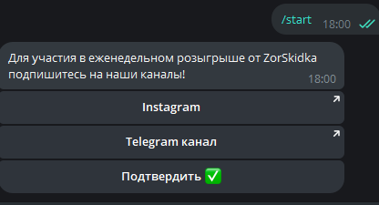
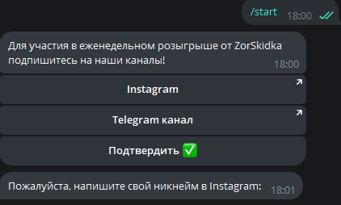
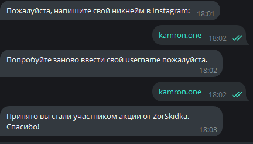
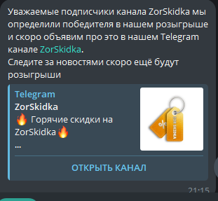
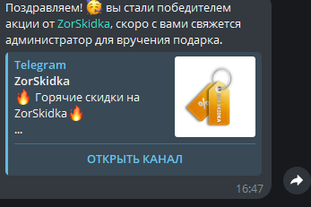

# Telegram bot aiogram 3 GiveawayBot
* Участие в розыгрыше: пользователи могут участвовать в розыгрыше, подписываясь на соц сети нажимая на кнопку.

* А потом нажимает на inline кнопку Подтвердить ✅

  
* Спросим у пользователя username Instagram что бы проверить подписан или нет если он действительно подписан то сохраняем его username и Telegram id в бд

  
* Что бы выбрать победителя есть у нас специальная команда /random он рандомно выбирает победителя.Победителя заблокируем на 20 дней что бы он не попадал на рандом ещё раз после 20 дней он может снова участвовать в розыгрыше
  

  
* У нас есть inline кнопки Да и Нет если нажимаем на кнопку да бот отправляет всем участникам сообщение(что мы выбрали победителя)
  

  
* А победителю отправим другое сообщение
  

# Установка
Для корректной работы требуется python версии 3.12

###   .env

    `TOKEN=''
     HOSTNAME_DB=''
     USER_DB=''
     PASSWORD_DB=''
     DATABASE_DB=''`
##### Установка зависимостей:

    `pip install -r requirements.txt`

#### Запуск:

    `python app.py`